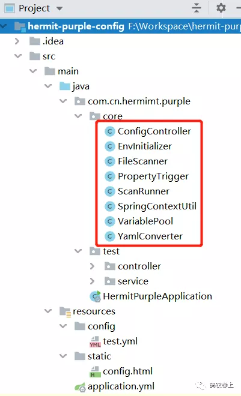
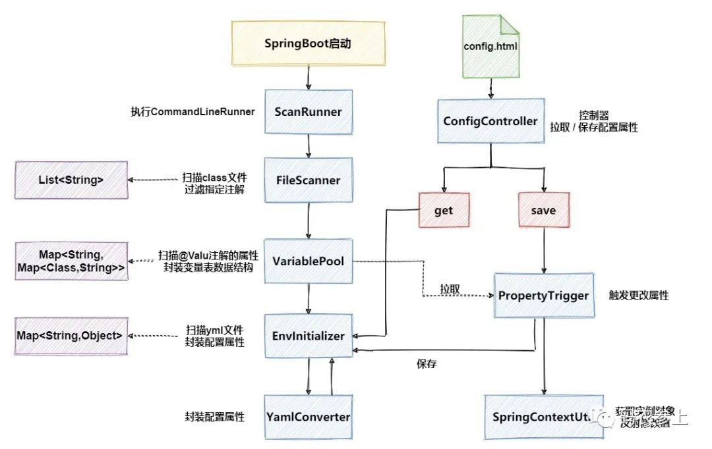
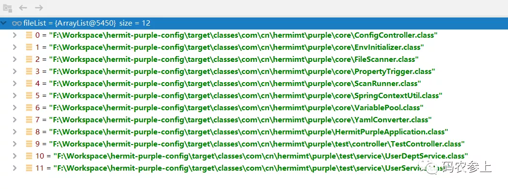
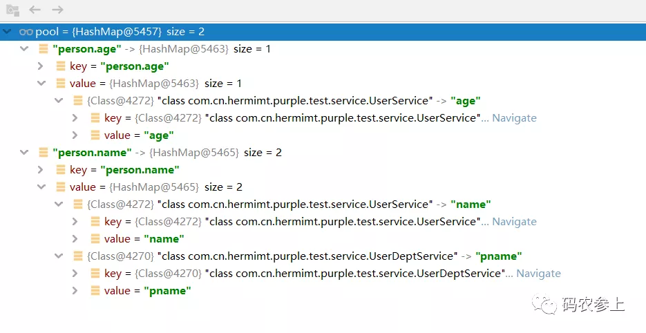
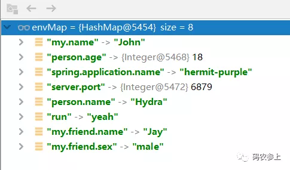
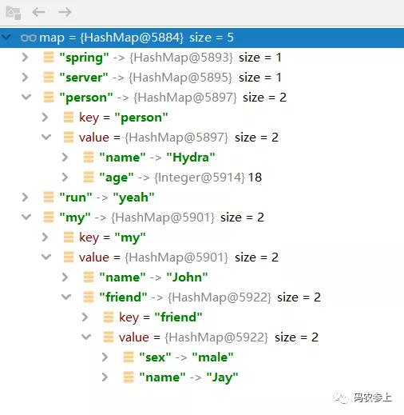

**配置中心**是我们平常使用微服务架构时重要的一个模块，常用的配置中心组件也比较多，从早期的Spring Cloud Config，到Disconf、Apollo、Nacos等，它们支持的功能、产品的性能以及给用户的体验也各有不同。

虽然说功能上有不少差异，但是它们解决的最核心问题，无疑是**配置文件修改后的实时生效**，有时候在搬砖之余我就在好奇实时生效是如何实现的、如果让我来设计又会怎么去实现，于是这几天抽出了点空闲时间，摸鱼摸出了个简易版的单机配置中心，先来看看效果：


之所以说是简易版本，首先是因为实现的核心功能就只有配置修改后实时生效，并且代码的实现也非常简单，一共只用了8个类就实现了这个核心功能，看一下代码的结构，核心类就是`core`包中的这8个类：



看到这是不是有点好奇，虽说是低配版，就凭这么几个类也能实现一个配置中心？那么先看一下总体的设计流程，下面我们再细说代码。



## 代码简要说明

#### 1、ScanRunner

`ScanRunner`实现了`CommandLineRunner`接口，可以保证它在springboot启动最后执行，这样就能确保其他的Bean已经实例化结束并被放入了容器中。至于为什么起名叫`ScanRunner`，是因为这里要实现的主要就是扫描类相关功能。先看一下代码：

```java
@Component
public class ScanRunner implements CommandLineRunner {
  @Override
  public void run(String... args) throws Exception {
    doScanComponent();
  }

  private void doScanComponent(){
    String rootPath = this.getClass().getResource("/").getPath();
    List<String> fileList = FileScanner.findFileByType(rootPath,null,FileScanner.TYPE_CLASS);
    doFilter(rootPath,fileList);
    EnvInitializer.init();
  }

  private void doFilter(String rootPath, List<String> fileList) {
    rootPath = FileScanner.getRealRootPath(rootPath);
    for (String fullPath : fileList) {
        String shortName = fullPath.replace(rootPath, "").replace(FileScanner.TYPE_CLASS,"");
        String packageFileName=shortName.replaceAll(Matcher.quoteReplacement(File.separator),"\\.");

        try {
            Class clazz = Class.forName(packageFileName);
            if (clazz.isAnnotationPresent(Component.class)
                    || clazz.isAnnotationPresent(Controller.class)
                    ||clazz.isAnnotationPresent(Service.class)){
                VariablePool.add(clazz);
            }
        } catch (ClassNotFoundException e) {
            e.printStackTrace();
        }
    }
  }    
}
```
真正实现文件扫描功能是调用的`FileScanner`，它的实现我们后面具体再说，在功能上它能够根据文件后缀名扫描某一目录下的全部文件，这里首先扫描出了`target`目录下全部以`.class`结尾的文件：



扫描到全部`class`文件后，就可以利用类的全限定名获取到类的`Class`对象，下一步是调用`doFilter`方法对类进行过滤。这里我们暂时仅考虑通过`@Value`注解的方式注入配置文件中属性值的方式，那么下一个问题来了，什么类中的`@Value`注解会生效呢？答案是通过`@Component`、`@Controller`、`@Service`这些注解交给spring容器管理的类。

综上，我们通过这些注解再次进行过滤出符合条件的类，找到后交给`VariablePool`对变量进行处理。

#### 2、FileScanner

`FileScanner`是扫描文件的工具类，它可以根据文件后缀名筛选出需要的某个类型的文件，除了在`ScanRunner`中用它扫描了class文件外，在后面的逻辑中还会用它扫描yml文件。下面，看一下`FileScanner`中实现的文件扫描的具体代码：

```java
public class FileScanner {
public static final String TYPE_CLASS=".class";
public static final String TYPE_YML=".yml";

public static List<String> findFileByType(String rootPath, List<String> fileList,String fileType){
    if (fileList==null){
        fileList=new ArrayList<>();
    }

    File rootFile=new File(rootPath);
    if (!rootFile.isDirectory()){
        addFile(rootFile.getPath(),fileList,fileType);
    }else{
        String[] subFileList = rootFile.list();
        for (String file : subFileList) {
            String subFilePath=rootPath + "\\" + file;
            File subFile = new File(subFilePath);
            if (!subFile.isDirectory()){
                addFile(subFile.getPath(),fileList,fileType);
            }else{
                findFileByType(subFilePath,fileList,fileType);
            }
        }
    }
    return fileList;
}

private static void addFile(String fileName,List<String> fileList,String fileType){
    if (fileName.endsWith(fileType)){
        fileList.add(fileName);
    }
}

public static String getRealRootPath(String rootPath){
    if (System.getProperty("os.name").startsWith("Windows")
            && rootPath.startsWith("/")){
        rootPath = rootPath.substring(1);
        rootPath = rootPath.replaceAll("/", Matcher.quoteReplacement(File.separator));
    }
    return rootPath;
}

}
```

查找文件的逻辑很简单，就是在给定的根目录`rootPath`下，循环遍历每一个目录，对找到的文件再进行后缀名的比对，如果符合条件就加到返回的文件名列表中。

至于下面的这个`getRealRootPath`方法，是因为在windows环境下，获取到项目的运行目录是这样的：

```
/F:/Workspace/hermit-purple-config/target/classes/
```

而class文件名是这样的：

```
F:\Workspace\hermit-purple-config\target\classes\com\cn\hermimt\purple\test\service\UserService.class
```

如果想要获取一个类的全限定名，那么首先要去掉运行目录，再把文件名中的反斜杠`\`替换成点`.`，这里就是为了删掉文件名中的运行路径提前做好准备。

#### 3、VariablePool

回到上面的主流程中，每个在`ScanRunner`中扫描出的带有`@Component`、`@Controller`、`@Service`注解的`Class`，都会交给`VariablePool`进行处理。顾名思义，`VariablePool`就是变量池的意思，下面会用这个容器封装所有带`@Value`注解的属性。

```java
public class VariablePool {
		public static Map<String, Map<Class,String>> pool=new HashMap<>();

		private static final String regex="^(\\$\\{)(.)+(\\})$";
		private static Pattern pattern;
		static{
    		pattern=Pattern.compile(regex);
		}

		public static void add(Class clazz){
    		Field[] fields = clazz.getDeclaredFields();

    		for (Field field : fields) {
        		if (field.isAnnotationPresent(Value.class)){
            		Value annotation = field.getAnnotation(Value.class);
            		String annoValue = annotation.value();
            		if (!pattern.matcher(annoValue).matches())
                		continue;

            		annoValue=annoValue.replace("${","");
            		annoValue=annoValue.substring(0,annoValue.length()-1);

            		Map<Class,String> clazzMap = Optional.ofNullable(pool.get(annoValue)).orElse(new HashMap<>());
            		clazzMap.put(clazz,field.getName());
            		pool.put(annoValue,clazzMap);
        		}
    		}
		}

		public static Map<String, Map<Class,String>> getPool() {
    		return pool;
		}

}
```

简单说一下这块代码的设计思路：

- 通过反射拿到`Class`对象中所有的属性，并判断属性是否加了`@Value`注解
- `@Value`如果要注入配置文件中的值，一定要符合`${xxx}`的格式（这里先暂时不考虑`${xxx:defaultValue}`这种设置了默认值的格式），所以需要使用正则表达式验证是否符合，并校验通过后去掉开头的`${`和结尾的`}`，获取真正对应的配置文件中的字段
- `VariablePool`中声明了一个静态HashMap，用于存放所有**配置文件中属性-类-类中属性**的映射关系，接下来就要把这个关系存放到这个`pool`中
  简单来说，变量池就是下面这样的结构：


这里如果不好理解的话可以看看例子，我们引入两个测试`Service`：

```java
@Service
public class UserService {
		@Value("${person.name}")
		String name;
		@Value("${person.age}")
		Integer age;
}

@Service
public class UserDeptService {
		@Value("${person.name}")
		String pname;
}
```

在所有`Class`执行完`add`方法后，变量池`pool`中的数据是这样的：



可以看到在`pool`中，`person.name`对应的内层Map中包含了两条数据，分别是`UserService`中的`name`字段，以及`UserDeptService`中的`pname`字段。

#### 4、EnvInitializer

在`VariablePool`封装完所有变量数据后，`ScanRunner`会调用`EnvInitializer`的`init`方法，开始对yml文件进行解析，完成配置中心环境的初始化。其实说白了，这个环境就是一个静态的HashMap，`key`是属性名，`value`就是属性的值。

```java
public class EnvInitializer {
		private static Map<String,Object> envMap=new HashMap<>();

		public static void init(){
    		String rootPath = EnvInitializer.class.getResource("/").getPath();
    		List<String> fileList = FileScanner.findFileByType(rootPath,null,FileScanner.TYPE_YML);
    		for (String ymlFilePath : fileList) {
        		rootPath = FileScanner.getRealRootPath(rootPath);
        		ymlFilePath = ymlFilePath.replace(rootPath, "");
        		YamlMapFactoryBean yamlMapFb = new YamlMapFactoryBean();
        		yamlMapFb.setResources(new ClassPathResource(ymlFilePath));
        		Map<String, Object> map = yamlMapFb.getObject();
        		YamlConverter.doConvert(map,null,envMap);
    		}
		}

		public static void setEnvMap(Map<String, Object> envMap) {
    		EnvInitializer.envMap = envMap;
		}
		public static Map<String, Object> getEnvMap() {
    		return envMap;
		}

}
```

首先还是使用`FileScanner`扫描根目录下所有的`.yml`结尾的文件，并使用spring自带的`YamlMapFactoryBean`进行yml文件的解析。但是这里有一个问题，所有yml文件解析后都会生成一个独立的Map，需要进行Map的合并，生成一份配置信息表。至于这一块具体的操作，都交给了下面的`YamlConverter`进行处理。

我们先进行一下演示，准备两个yml文件，配置文件一：`application.yml`

```yaml
spring:
	application:
		name: hermit-purple
server:
	port: 6879
person:
	name: Hydra
	age: 18
```

配置文件二：`config/test.yml`

```yaml
my:
	name: John
	friend:
		name: Jay
		sex: male
run: yeah
```

先来看一看环境完成初始化后，生成的数据格式是这样的：



#### 5、YamlConverter

`YamlConverter`主要实现的方法有三个：

- `doConvert()`：将`EnvInitializer`中提供的多个Map合并成一个单层Map

- `monoToMultiLayer()`：将单层Map转换为多层Map（为了生成yml格式字符串）

- `convert()`：yml格式的字符串解析为Map（为了判断属性是否发生变化）


由于后面两个功能暂时还没有涉及，我们先看第一段代码：

```java
public class YamlConverter {
		public static void doConvert(Map<String,Object> map,String parentKey,Map<String,Object> propertiesMap){
				String prefix=(Objects.isNull(parentKey))?"":parentKey+".";
				map.forEach((key,value)->{
					if (value instanceof Map){
            doConvert((Map)value,prefix+key,propertiesMap);
          }else{
            propertiesMap.put(prefix+key,value);
          }
        });
    }
  //...
}    

```

逻辑也很简单，通过循环遍历的方式，将多个Map最终都合并到了目的`envMap`中，并且如果遇到多层Map嵌套的情况，那么将多层Map的key通过点.进行了连接，最终得到了上面那张图中样式的单层Map。

其余两个方法，我们在下面使用到的场景再说。

#### 6、ConfigController

`ConfigController`作为控制器，用于和前端进行交互，只有两个接口`save`和`get`，下面分别介绍。

###### get

前端页面在开启时会调用`ConfigController`中的`get`接口，填充到`textArea`中。先看一下`get`方法的实现：

```java
@GetMapping("get")
public String get(){
		ObjectMapper objectMapper = new ObjectMapper(new YAMLFactory());
		String yamlContent = null;
		try {
				Map<String, Object> envMap = EnvInitializer.getEnvMap();
				Map<String, Object> map = YamlConverter.monoToMultiLayer(envMap, null);
				yamlContent = objectMapper.writeValueAsString(map);
		} catch (Exception e) {
				e.printStackTrace();
		}
		return yamlContent;
}
```

之前在项目启动时，就已经把配置文件属性封装到了`EnvInitializer`的`envMap`中，并且这个`envMap`是一个单层的Map，不存在嵌套关系。但是我们这里要使用`jackson`生成标准格式的yml文档，这种格式不符合要求，需要将它还原成一个具有层级关系的多层Map，就需要调用`YamlConverter`的`monoToMultiLayer()`方法。

`monoToMultiLayer()`方法的代码有点长，就不贴在这里了，主要是根据key中的.进行拆分并不断创建子级的Map，转换完成后得到的多层Map数据如下：



在获得这种格式后的Map后，就可以调用`jackson`中的方法将Map转换为yml格式的字符串传递给前端了，看一下处理完成后返回给前端的字符串：


###### save

在前端页面修改了yml内容后点击保存时，会调用`save`方法保存并更新配置，方法的实现如下：

```java
@PostMapping("save")
public String save(@RequestBody Map<String,Object> newValue) {
		String ymlContent =(String) newValue.get("yml");
		PropertyTrigger.change(ymlContent);
		return "success";
}
```

在拿到前端传过来的yml字符串后，调用`PropertyTrigger`的`change`方法，实现后续的更改逻辑。

#### 7、PropertyTrigger

在调用`change`方法后，主要做的事情有两件：

- 修改EnvInitializer中的环境envMap，用于前端页面刷新时返回新的数据，以及下一次属性改变时进行对比使用

- 修改bean中属性的值，这也是整个配置中心最重要的功能

先看一下代码：

```java
public class PropertyTrigger {
		public static void change(String ymlContent) {
				Map<String, Object> newMap = YamlConverter.convert(ymlContent);
				Map<String, Object> oldMap = EnvInitializer.getEnvMap();

    		oldMap.keySet().stream()
          .filter(key->newMap.containsKey(key))
          .filter(key->!newMap.get(key).equals(oldMap.get(key)))
          .forEach(key->{
            System.out.println(key);
            Object newVal = newMap.get(key);
            oldMap.put(key, newVal);
            doChange(key,newVal);
          });
      EnvInitializer.setEnvMap(oldMap);
    }

		private static void doChange(String propertyName, Object newValue) {
      System.out.println("newValue:"+newValue);
      Map<String, Map<Class, String>> pool = VariablePool.getPool();
      Map<Class, String> classProMap = pool.get(propertyName);
      
      classProMap.forEach((clazzName,realPropertyName)->{
        try {
            Object bean = SpringContextUtil.getBean(clazzName);
            Field field = clazzName.getDeclaredField(realPropertyName);
            field.setAccessible(true);
            field.set(bean, newValue);
        } catch (NoSuchFieldException | IllegalAccessException e) {
            e.printStackTrace();
        }
      });
    }
}
```

前面铺垫了那么多，其实就是为了实现这段代码中的功能，具体逻辑如下：

- 调用`YamlConverter`的`convert`方法，将前端传来的yml格式字符串解析封装成单层Map，数据格式和`EnvInitializer`中的`envMap`相同

- 遍历旧的`envMap`，查看其中的key在新的Map中对应的属性值是否发生了改变，如果没有改变则不做之后的任何操作

- 如果发生改变，用新的值替换`envMap`中的旧值

- 通过属性名称，从`VariablePool`中拿到涉及改变的`Class`，以及类中的字段`Field`。并通过后面的`SpringContextUtil`中的方法获取到这个bean的实例对象，再通过反射改变字段的值

- 将修改后的Map写回`EnvInitializer`中的`envMap`

到这里，就实现了全部的功能。

#### 8、SpringContextUtil

`SpringContextUtil`通过实现`ApplicationContextAware`接口获得了spring容器，而通过容器的`getBean()`方法就可以容易的拿到spring中的bean，方便进行后续的更改操作。

```java
@Component
public class SpringContextUtil implements ApplicationContextAware {
  private static ApplicationContext applicationContext;
  @Override
  public void setApplicationContext(ApplicationContext applicationContext) throws BeansException {
    this.applicationContext = applicationContext;
  }
  public static <T> T getBean(Class<T> t) {
    return applicationContext.getBean(t);
  }
}
```


#### 9、前端代码

至于前端代码，就是一个非常简单的表单，代码的话可以移步git查看。

## 最后

到这里全部的代码介绍完了，最后做一个简要的总结吧，虽然通过这几个类能够实现一个简易版的配置中心功能，但是还有不少的缺陷，例如：

- 没有处理@ConfigurationProperties注解

- 只处理了yml文件，没有处理properties文件

- 目前处理的bean都是基于singleton模式，如果作用域为prototype，也会存在问题

- 反射性能低，如果某个属性涉及的类很多会影响性能

- 目前只能代码嵌入到项目中使用，还不支持独立部署及远程注册功能

- ……
